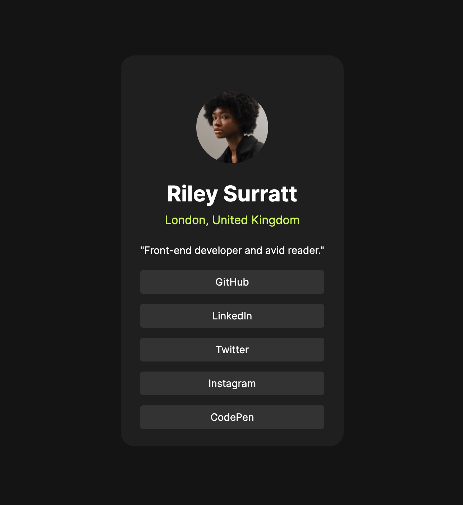

# Frontend Mentor - Social links profile solution

This is a solution to the [Social links profile challenge on Frontend Mentor](https://www.frontendmentor.io/challenges/social-links-profile-UG32l9m6dQ). Frontend Mentor challenges help you improve your coding skills by building realistic projects. 

## Table of contents

- [Overview](#overview)
  - [The challenge](#the-challenge)
  - [Screenshot](#screenshot)
  - [Links](#links)
- [My process](#my-process)
  - [Built with](#built-with)
  - [What I learned](#what-i-learned)
  - [Continued development](#continued-development)
  - [Useful resources](#useful-resources)
- [Author](#author)
- [Acknowledgments](#acknowledgments)


## Overview

### The challenge

Users should be able to:

- See hover and focus states for all interactive elements on the page

### Screenshot




### Links

- Solution URL: [Add solution URL here]
- Live Site URL: [Add live site URL here]

## My process

### Built with

- Semantic HTML5 markup
- CSS custom properties
- Flexbox
- Mobile-first workflow


### What I learned

- styled a paragraph to give the illusion of a button
``` css
.button {
    border-radius: 4px;
    background-color: hsl(0, 0%, 20%);
    padding: 8px 12px;
    font-size: 14px;
    cursor: pointer;
}
```
- when creating card like features, create as many nested containers to optomize customization 

# Colors

Primary

- Green: hsl(75, 94%, 57%)

Neutral

- White: hsl(0, 0%, 100%)
- Grey: hsl(0, 0%, 20%)
- Dark Grey: hsl(0, 0%, 12%)
- Off Black: hsl(0, 0%, 8%)

# Typography

Body Copy

- Font size (paragraph): 14px

# Font

- Family: [Inter](https://fonts.google.com/specimen/Inter)
- Weights: 400, 600, 700

### Continued development

- recreating this style with active buttons and links


### Useful resources

- [UIverse](https://uiverse.io/) - This helped me get an idea for proportion sizes for different size cards based on content.


## Author

- Website - [Riley Surratt](https://www.your-site.com)
- Frontend Mentor - [@yourusername](https://www.frontendmentor.io/profile/yourusername)
- Twitter - [@yourusername](https://www.twitter.com/yourusername)


## Acknowledgments


